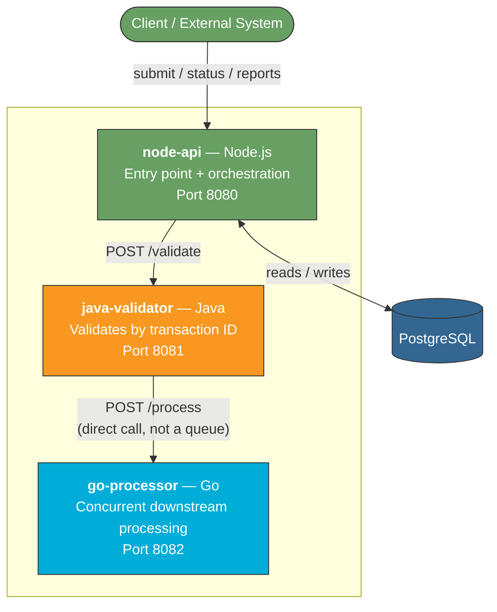

[README (3).md](https://github.com/user-attachments/files/31985546/README.3.md)
# Transaction Processing Demo

A small multi-service system modeled on a transaction processing platform I built professionally: a batch pipeline that originally depended on third-party modules, replaced with in-house APIs across Java, Go, and Node.js for validation and downstream processing, backed by a relational database.

This isn't a copy of any proprietary code, it's a from-scratch build mirroring the same architecture and the same design trade-offs.

## Architecture



**node-api** is the only service that touches the database. It's the entry point for the outside world: submit a transaction, check its status, pull a summary report. It also owns orchestration, calling the Java service and persisting whatever the pipeline decides.

**java-validator** validates a transaction by its transaction ID, rejecting duplicates and out-of-range amounts. On success, it calls `go-processor` directly over HTTP rather than through a queue, the same trade-off made in the real system this is modeled on: lower latency in exchange for tighter coupling between the two services.

**go-processor** simulates the downstream work (ledger update, settlement, notification) with a short randomized delay. Go's standard `net/http` server already handles each request in its own goroutine, so concurrent processing under load doesn't need any extra worker-pool code.

Java and Go are both dependency-free, JDK built-ins and the Go standard library only, so neither needs a package manager to build. Node uses `express` and `pg` from npm.

## Tech stack

| Layer | Technology | Role |
|---|---|---|
| API / orchestration | Node.js, Express, pg | Entry point, owns Postgres, calls the validator |
| Validation | Java (JDK built-ins, no framework) | Checks transaction ID, dedup, business rules |
| Downstream processing | Go (standard library only) | Concurrent simulated processing |
| Persistence | PostgreSQL | Transaction records |

## Running it

**Docker Compose** (recommended, starts all four services with one command):
```bash
docker compose up --build
```
The API is then available at `http://localhost:8080`.

**Natively**, each service can also be run on its own, see the code comments in each service's entry point (`node-api/index.js`, `java-validator/src/Validator.java`, `go-processor/main.go`) for the exact build and run commands, they're standard for each language (`npm install && node index.js`, `javac` + `java`, `go build` + run the binary).

## API

| Method | Path | Purpose |
|---|---|---|
| POST | `/transactions` | Submit a transaction |
| GET | `/transactions/:id` | Check a transaction's status |
| GET | `/reports/summary` | Counts and totals grouped by status |
| GET | `/health` | Health check |

```bash
curl -X POST http://localhost:8080/transactions \
  -H "Content-Type: application/json" \
  -d '{"transactionId":"TXN-1001","amount":250.00}'
```

## Load testing

`scripts/load_test.js` fires a batch of concurrent transactions at the API and reports throughput:
```bash
node scripts/load_test.js 200 20
```
Adjust the two numbers (transaction count, concurrency) to push it further.

## Design notes

- **Duplicate detection happens at the database level in `node-api`**, not just in Java's in-memory check. A resubmitted transaction ID is rejected with a 409 before the pipeline runs again. This wasn't the original design, an earlier version updated a transaction's row unconditionally after validation, which meant a resubmitted duplicate could silently overwrite an already-processed record's status. Checking whether the insert actually happened, before calling the validator at all, closed that gap.
- **Postgres stands in for Oracle/DB2** here, since those aren't practical to run in a small local project. The service boundaries and data access pattern are what carry over, not the specific database product.
- **The direct API call between Java and Go is a deliberate, debatable choice**: faster per transaction than a queue, but couples the two services more tightly. Worth weighing against a message queue if this were handling production volume rather than a demo.

## License

MIT
